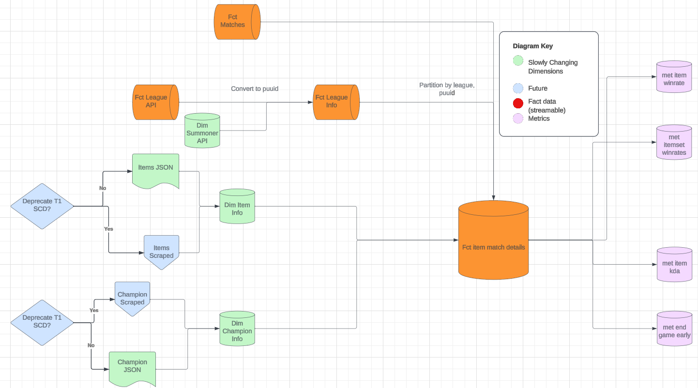
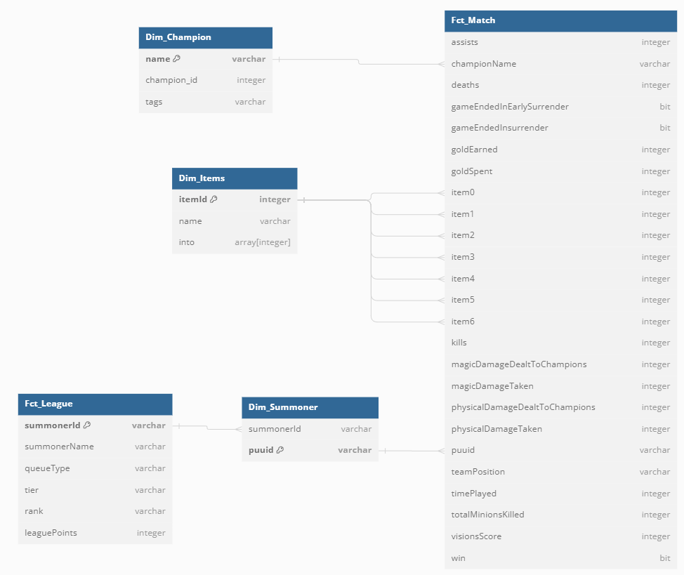

# League of Legends Data Mining Project

# Overview
The  final requirement to fulfill my desired certification level with EcZachly's Data Engineering Bootcamp is an engineered dataset from raw sources into a polished dataset using modern technologies. Despite that being the case of how this project started, the intent is to use this as a chance to perform data science on League of Legends. The focus of this project is to investigate the items in League of Legends, their performance, and metrics on what makes a good item and some assistance to discover interesting builds, both crowdsourced as it is today and certain unseen builds that might be worth a try.

 Indeed, [Kaggle does possess a wealth of datasets  from Riot's Match API or League of Legends (LoL) Esports matches](https://www.kaggle.com/search?q=league+of+legends+in%3Adatasets), but none have an ideal collation of matches with item statistics. Item builds have been a controversial debate since League's inception, but has picked up steam in recent years. Moreover, League has done another significant overhaul of the item system. Every week there are certain builds and "techs" discovered, from [purchasing multiple support items on the same team](https://www.reddit.com/r/summonerschool/comments/195i0v1/new_double_support_item_math/?rdt=44431) to trying out [auto attack manipulation on different champions with Titanic Hydra on ranged champions.](https://www.reddit.com/r/leagueoflegends/comments/1abowwy/new_tech_on_cait_taking_over_the_top_of_the/) 
 
 Even moreso, since certain Esports Leagues are playing on the live patch as opposed to traditionally being a week+ behind, it is even more critical to discover new strategies faster. While there are sites such as Blitz.gg that can recommend item builds, those are usually dependent on what occurred in the patch and recommends the most popular buiilds. In addition, they do not offer the data in a disaggregated manner to investigate. With the item changes in constant flux, a consistently updated item dataset would serve the community well. A goal is to obtain a Riot Developer API Key to significantly assist the community and perhaps integrate more real-time streaming capabilities.

## Target Audience
 The target audience are fellow data inquisitors interested in exploring characteristics of the game or honing their data science skills. Most of the intended audience will be familiar with the game. In the interest of not making this too large, this project will assume that the target audience has a modicum amount of knowledge in League of Legends. For those that may be new but have a background in data, [here is a resource explaining the fundamentals of LoL.](https://store.epicgames.com/en-US/news/a-beginner-s-guide-to-league-of-legends)

## Desired Insights
As mentioned prior, there is a significant amount of sites that can answer what the highest winrate builds from existing match data. At minimum, this dataset needs to be able to answer those questions. Some variations include:
- What itemsets have the highest winrate for a champion overall? How about in a given matchups?
- For each item, what are their best performing champions?
- What is an item's winrate by rank?
- Given an item, what champion class best utilizes it? How about the converse? *note: most sides do not provide this answer.*

Here are some questions that are not easily answered by many of the recommender sites:
- What are the most common items that result in an early victory? What are their highest buyers in those games?
- What items are ideal for taking neutral objectives directly compared to others? Are there scenarios where those items suffer a significant deviation in effectiveness?
- Construct a class of items based on similar characteristics and compare them with each other. Under what circumstances and breakpoints do they outperform each other? Which characteristics are invariant to champion kits?

These are some sample complex insights that are a project in its own right. However, without an easily available dataset, many of these are simply too difficult to produce. Many of these can be answered with the same dataset. Ideally this is an example of the critical utility that data enginners can provide.

 ## Datasets

 The goal is to produce a final dataset that fulfils these characteristics:
 - Is highly accurate.
 - Is in a straightforward format (i.e. schema).
 - Has the dimensions updated soon after a new patch or hotfix is pushed.
 - Requires a minimal amount of joins to ingest and visualize.
 - Provides a single platform to easily pull data from.

Before we go into the datasets, some of these require access to Riot's API and their IP. To account for that, please read the following legal disclaimer:

> This LoL Datamining Project is not endorsed by Riot Games and does not reflect the views or opinions of Riot Games or anyone officially involved in producing or managing Riot Games properties. Riot Games and all associated properties are trademarks or registered trademarks of Riot Games, Inc
 
 
 To fulfil the required final dataset, we need data that can provide the basis for these. We will start with the Riot API and what it has to offer. Below is what is currently implemented and what is a future is in **(WIP)** which stands for **Work In Progress**.

 - [Account Information](https://developer.riotgames.com/apis#account-v1) **(WIP)**
 - [Summoner Information](https://developer.riotgames.com/apis#summoner-v4)

 To tie the info to certain accounts that can give information to playstyle, trends, and preferred champions, the account information is required. Since some Riot APIs deprecate summoner info, account information is used, but some still use summonerId instead of a puuid. Both are required to union an account's information. 
 - [Champion Information](https://ddragon.leagueoflegends.com/cdn/14.2.1/data/en_US/champion.json)
 - [Item Information](https://ddragon.leagueoflegends.com/cdn/14.2.1/data/en_US/item.json)

 The dimensional data required to perform basic analytics and deserialize certain entries in other datasets.

 - [Queue Type](https://static.developer.riotgames.com/docs/lol/queues.json) **(WIP)**
 - [Map ID](https://static.developer.riotgames.com/docs/lol/maps.json) **(WIP)**

Usually, items are balanced around Summoners Rift for 5v5 Ranked Solo Queue. However, the principles can still be applied to different queues and rotating game modes, especially if there are certain buffs or reduced cooldowns that could significantly change an item's power (e.g. URF Mode).

To avoid cardinality explosions at this stage, only summoner's rift 5v5 is used.

- [League Information](https://developer.riotgames.com/apis#league-v4)
- [Match Data](https://developer.riotgames.com/apis#match-v5)
- [Champion Mastery](https://developer.riotgames.com/apis#champion-mastery-v4) **(WIP)**

Finally we come to the fact data which is a large amount of what the data mining will be based off of. The Match Data has a large amount of columns, some of which are in complex forms (e.g. arrays) or enumerated fields. This project serves to unnest, dedupe, and provide a simple table to join post-shuffle.

## Tech Stack Used
For now, the tech stack is deceptively complicated for the low amount of tools:
- Python Notebooks
- Azure Synapse Analytics

Azure Synapse Analytics is Microsoft Azure's all in one shop for data integration. It differs from Data Factory in that it has more tools to support data scientists and integration with other microservices, such as Azure ML Studio. As a data scientist and data integration lead, I have used Azure Synapse for some time, but not often did I use it to handle data engineering tasks. With the skills developed at EcZachly's Data Engineering bootcamp in addition to my experience, the power of the tool is shown with these characteristics:

- Creation and running of Python Notebooks.
- Connection with external data sources or provisioned data systems such as blob or SQL DBs.
- Data Engineering flows and pipelines readily created in the workspace. 
- Various validation methods similar to dbt that can perform simple sanity checks or complex queries.
- In the event a check is too complex for the native data flow tools, synapse offers seamless integration with notebooks, SQL scripts, and external and dedicated data sources.
- Orchestration of pipelines to run, which will be essential to pull data while avoiding the API rate limit.
- Streaming data option.

The downside of Synapse is it's cost. For the convenience, it does require payment. However, Azure does provide $200 in credits used within the first month. By the end of February, the project is expected to have the dataset complete, where the costs will be assessed to either keep or slowly deprecate Synapse for other tools and flows.

## Schema and Diagrams
Below is the current proces in obtaining the non-WIP datasets and transforming it into one dataset with supplied metrics.

You'll notice that some of the flows have the prompt to deprecate T1 SCD. While these should be T2 SCDs since it is logged by patch, the issue is that there is no simple method to ensure Riot updated the information correctly after reading this statement from their API docs:

> Updating Data Dragon after each League of Legends patch is a manual process, so it is not always updated immediately after a patch.

Because of this, it is not ideal to rely on Data Dragon (the JSON apis used for some of the Dim data) in the future. There are some files that seek to scrape the data. However, to remain an ethical scraper, that project was delayed until it is refactored to scrape from [The LoL Wiki](https://leagueoflegends.fandom.com/wiki/Item_(League_of_Legends)). You can view the [current progress of the code here](https://github.com/HjersmanJ/LoL-Item-Datamining/blob/data_engineering/notebook/Web%20Scraping%20LoL%20items.json).

The flow begins by grabbing the relevant dimensional data on items, champions, and summoner info to convert to puuids. With the Fct Data, the summoner info provided to convert to the correct key that is used in the Fct Matches dataset. Once this is correctly aggregated and partitioned by league (since an account can only be in one league at any given moment in time), the match dataset is unnested with the required items appended or joined to produce the metrics. The data 

